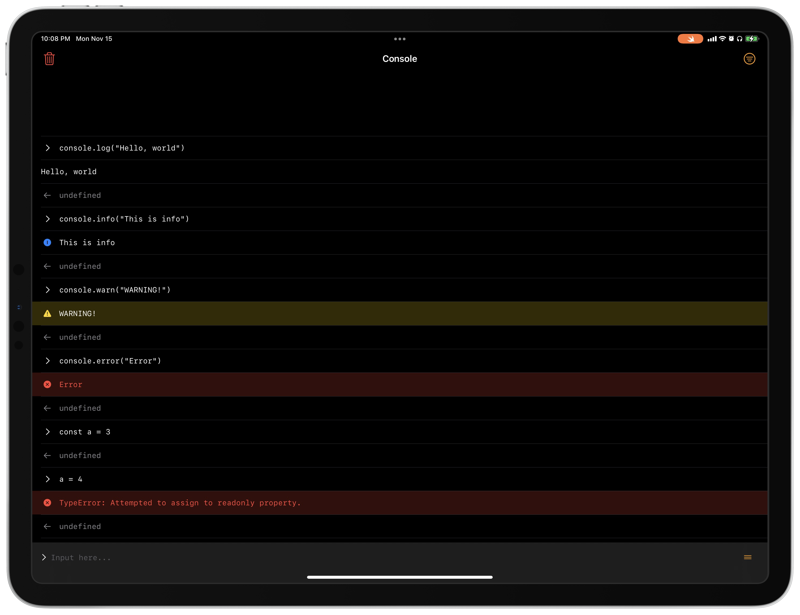

# JS Console

JS Console is an iPadOS/iOS app. You can run JavaScript code through JavaScriptCore on the console.

## Target platforms

- iPadOS 15.2 or later
- iOS 15.2 or later

## Build requirements

- Swift Playgrounds 4.0 or later (iPadOS 15.2 or later)
- Xcode 13.2 or later (macOS 11.3 or later)
