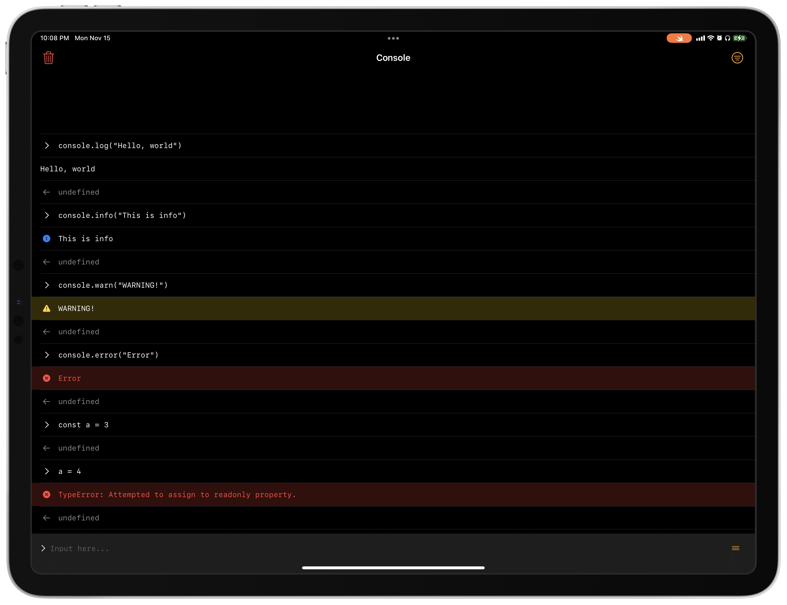

# Console Pad

Console Pad is an iPadOS/iOS app. You can run JavaScript code through JavaScriptCore on the console.

## Target platforms

- iPadOS 26.0 or later
- iOS 26.0 or later

## Get Started

Console Pad is available on [TestFlight](https://testflight.apple.com/join/ZJulplz9).

Or you can build from source.

## Build from source

### Requirements

- Swift Playground 4.7 or later (iPadOS 26.0 or later)
- Swift Playground 4.7 or later (macOS 15.0 or later)
- Xcode 26.0 or later (macOS 15.6 or later)

### Instructions

1. Clone this repository
    - To clone, I recommend using [Working Copy](https://workingcopyapp.com) or [a-Shell](https://holzschu.github.io/a-Shell_iOS/) (`lg2` command).
2. Open ConsolePad.swiftpm with Swift Playground
3. Run
